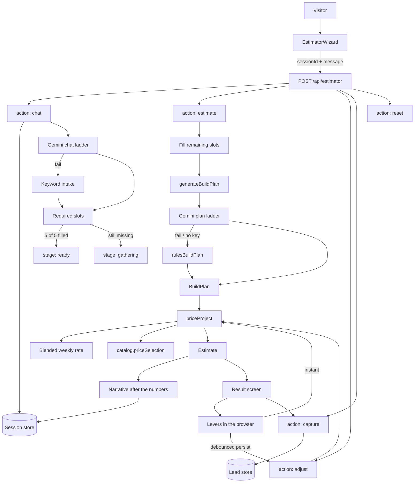
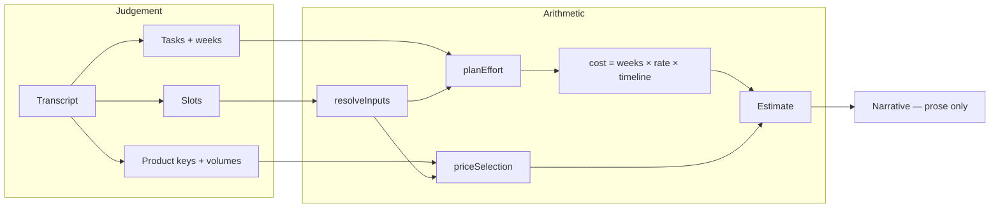
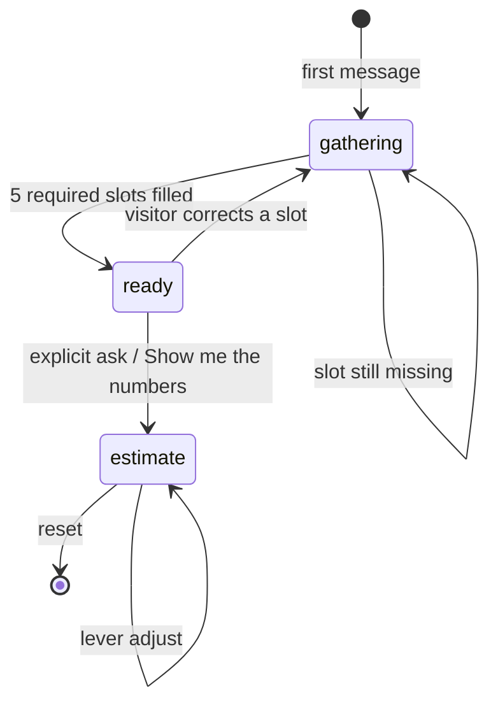
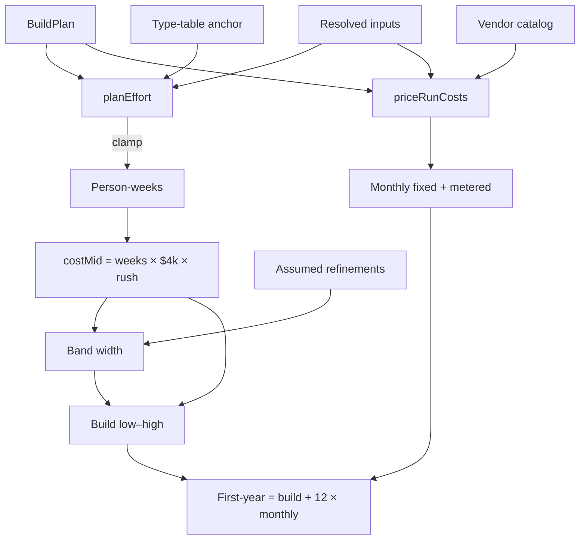

# Cost Estimator — System Design

How ZAC Estimator turns a short conversation into a defensible quote.

The tool answers **"what will this cost?"** — not "what should we build?". That
split is the whole architecture: the model judges *what work* and *which
products*; code owns every dollar figure.

**Route:** `/tools/estimator` · **API:** `GET|POST /api/estimator`

---

## 1. Design tree

```
Cost Estimator
│
├── Surface
│   ├── /tools/estimator ..................... focus-mode chat page
│   ├── EstimatorWizard ...................... client UI (chat → pricing → result)
│   └── EstimateCapture ..................... optional email after the number
│
├── API  POST /api/estimator
│   ├── chat ........ SSE turn; fill slots; never quote money
│   ├── estimate .... plan + price + narrative
│   ├── adjust ...... re-price stored plan (no model)
│   ├── capture ..... attach name/email to an existing estimate
│   └── reset ....... wipe session
│
├── Session  (server-owned; client holds only a UUID)
│   ├── messages, slots, overrides
│   ├── stage: gathering → ready → estimate
│   └── cached estimate + narrative
│
└── Engine
    ├── Chat ........ Gemini (or keyword rules) → slots
    ├── Plan ........ Gemini (or rules) → tasks + product picks
    ├── Catalog ..... vendor list prices (never invented)
    └── Pricing ..... effort × rate + catalog math → Estimate
```

---

## 2. End-to-end flow



---

## 3. Module tree

```
src/
├── app/(frontend)/
│   ├── tools/estimator/page.tsx ........ page shell; loads EstimatorWizard
│   └── api/estimator/route.ts .......... chat / estimate / adjust / capture / reset
│
├── components/shared/
│   ├── estimator-wizard.tsx ............ conversation, levers, result
│   └── estimate-capture.tsx ............ optional post-estimate lead form
│
└── lib/estimator/
    ├── schema.ts ..... contracts: slots, plan, estimate, stages
    ├── session.ts .... Redis/memory store; client cannot forge state
    ├── prompts.ts .... chat / extract / plan / narrative instructions
    ├── chat.ts ....... streaming turns, slot merge, keyword fallback
    ├── plan.ts ....... Gemini build plan, or deterministic rules plan
    ├── catalog.ts .... vendor prices; priceSelection(); prompt menu
    └── pricing.ts .... the only place a dollar figure is produced
```

---

## 4. What owns what

The model is allowed judgement. It is **not** allowed arithmetic.

```
                        MODEL (judgement)              CODE (arithmetic)
                        ─────────────────              ─────────────────
Conversation            reply, slot mapping            merge, infer, progress
Build                   named tasks + person-weeks     clamp to anchor band
Running cost            which catalog keys + volume    list price × usage
Levers                  —                              ratio vs plan baseline
Headline number         forbidden                      effort × rate × rush
Monthly bill            forbidden                      catalog.priceSelection
Narrative               explain numbers already set    numbers are frozen first
```

If the model writes `$4,000` into a task name, `plan.ts` strips it. Unknown
catalog keys are dropped, not guessed.



---

## 5. Conversation (gathering → ready)

Five **required** slots must be known before pricing. Four **refinements** are
never blocking — they default, show as assumed, and become levers.

```
Slots
├── Required (blocks pricing until filled)
│   ├── summary ........ visitor's own words
│   ├── projectType .... Web app | Mobile | Marketing site | Internal tool |
│   │                    AI / automation | Data & analytics | E-commerce
│   ├── platform ....... Web | Mobile | Web + mobile | Internal only
│   ├── scope .......... MVP | Full product | Rebuild | Add to existing
│   └── timeline ....... ASAP | This quarter | Next 6 months | Exploring
│
└── Refinements (defaults + levers)
    ├── scale .......... Under 1k | 1k–10k | 10k–100k | 100k+
    ├── designState .... Scratch | Brand only | Designs ready
    ├── integrations ... 0–20
    └── regulated ...... boolean
```



**How a turn is produced**

```
streamEstimatorTurn
├── Gemini available?
│   ├── yes → CHAT_MODELS ladder, JSON schema, stream `reply`
│   └── no  → rulesEstimatorTurn
├── coerceTurn
│   ├── enum-validate slots
│   ├── keep richer summary (visitor words beat paraphrase)
│   ├── inferEstimatorSlots if a required slot is still empty
│   └── wantsEstimate only on an explicit cost/quote/ballpark ask
└── persist: append messages, merge slots, set stage
```

A bare "yes"/"ok" is an answer to the last question, never a request to price.

---

## 6. Estimate action (ready → priced)

Triggered only by an explicit ask, the result CTA, or the wizard escape hatch.
Never inferred from a conversational "yes".

```
handleEstimate
│
├── 1. extractEstimatorSlots
│   ├── keyword guesses
│   └── one Gemini extract call if anything is still empty
│
├── 2. resolveInputs(slots, overrides)
│   └── fill refinements with defaults; remember what was assumed
│
├── 3. generateBuildPlan          ← one expensive model call
│   ├── Gemini BLUEPRINT_MODELS, temperature 0.3
│   │   ├── approach
│   │   ├── tasks[]     name, discipline, person-weeks
│   │   └── runCosts[]  catalog key, qty, monthly usage
│   └── on failure → rulesBuildPlan (keyword stack + workstream split)
│
├── 4. priceProject               ← pure function, isomorphic
│   ├── build band from effort
│   └── monthly bill from catalog
│
├── 5. generateNarrative          ← after numbers exist; cannot move them
│   └── on failure the estimate still ships
│
└── 6. save session  stage = estimate
```

---

## 7. Build plan

The plan is what makes the quote *this* project instead of a lookup table.

```
BuildPlan
├── source ........... gemini | rules
├── baseline ......... scale, designState, integrations, regulated
│                      (frozen at plan time so levers apply ratios, not
│                       a second copy of the same multiplier)
├── approach ......... 1–2 sentences on architecture (no prices)
├── tasks[]  (5–12)
│   ├── name ......... specific: "WhatsApp order intake workflow"
│   ├── discipline ... Discovery | Design | Engineering | AI & data |
│   │                  Integrations | QA | Delivery | Launch
│   ├── weeks ........ person-weeks (not calendar)
│   └── note
└── runCosts[]
    ├── key .......... must be a catalog key or the line is dropped
    ├── qty .......... seats / instances
    ├── usage[] ...... { meter, monthly volume }
    └── why
```

**Rules fallback** (Gemini down or empty plan): split `anchorEffortWeeks` across
the six standard workstreams, pick hosting/db/monitoring from keywords, scale
usage with the same curve the scale lever uses. Losing the model costs
specificity, not a broken number.

---

## 8. Pricing engine

`priceProject` is the only function that emits money. The result screen re-runs
it in the browser when a lever moves, seeded with the server's
`blendedRateUsd`, so there is one set of rules.

```
priceProject(slots, overrides, plan, rate)
│
├── resolveInputs
│   └── assumed[]  (widens the band later)
│
├── Effort
│   ├── with plan → planEffort
│   │   ├── taskWeeks × (scaleΔ × designΔ × regulatedΔ)
│   │   ├── + (integrations − baseline) × 1.2 weeks
│   │   └── clamp to [0.3×, 2.6×] of the type-table anchor
│   └── without plan → anchorEffortWeeks
│       └── base[type] × scope × platform × scale × regulated
│           × design + integrations × 1.2
│
├── Money
│   ├── costMid = effortWeeks × weeklyRate × timelineRush
│   ├── confidence ↓ 0.11 per assumed refinement,
│   │               ↓ 0.10 thin summary,
│   │               ↓ 0.12 if the plan was clamped
│   ├── spread  = 0.15 + (1 − confidence) × 0.22
│   └── band    = costMid ± spread   (rounded)
│
├── Schedule
│   ├── team size from effort (ASAP adds one person)
│   └── calendarWeeks = max(scope floor, ceil(effort / size × 1.25))
│
└── Run costs → priceRunCosts
```

**Anchor table** (sanity band only once a plan exists)

| Project type        | Base person-weeks |
|---------------------|-------------------|
| Marketing website   | 6                 |
| Internal tool       | 12                |
| AI / automation     | 16                |
| Data & analytics    | 16                |
| E-commerce          | 18                |
| Web app or platform | 20                |
| Mobile app          | 20                |

Default blended rate: **$4,000 / person-week** (`ESTIMATOR_WEEKLY_RATE_USD`).

**Why lever deltas are ratios.** A plan written for 10k users already includes
that scale. Dragging the lever to 100k applies `1.45 / 1.2`, not another `1.45`.
Metered usage uses a steeper curve (`SCALE_USAGE_MULT`) because ten times the
users is roughly ten times the API calls, not ten times the engineering.



---

## 9. Vendor catalog (running cost)

The model never recalls a price. It picks a **key** and a **volume**;
`catalog.ts` supplies every figure. Prices are list USD, monthly, dated
(`PRICES_AS_OF`).

```
CatalogEntry
├── key, vendor, plan, category
├── baseMonthlyUsd ........ subscription (× qty if perSeat)
├── meters[]
│   ├── id, unit
│   ├── unitUsd / per ..... e.g. $0.30 per 1,000,000 tokens
│   └── includedUnits ..... allowance before metering
├── note
└── cheaperAlternative .... shown, not auto-applied
```

```
priceSelection(selection, usageMultiplier)
├── unknown key → drop the line
├── fixedUsd  = base × qty
└── meteredUsd = Σ max(0, volume × usageMult − included) / per × unitUsd
```

Monthly band is **asymmetric**: subscriptions are known; usage is a projection
that is more often low than high.

```
monthlyLow  = fixed + metered × 0.6
monthlyMid  = fixed + metered
monthlyHigh = fixed + metered × 2
firstYear   = build ± 15%  +  12 × monthly band
```

**Categories:** automation · AI model · hosting · database · auth · comms ·
payments · storage · analytics · search · monitoring · other (placeholder SaaS
tiers for tools we have not priced).

---

## 10. Result screen & levers

```
Result
├── Build band, duration, team, confidence label
├── Approach (from the plan)
├── Narrative + risks (presentation only)
├── Breakdown by task / discipline
├── Monthly run-cost table + first-year total
├── Levers — scale, design, integrations, regulated, timeline
│   ├── instant: priceProject() in the browser
│   └── persist: debounced POST action=adjust (same function, stored plan)
└── EstimateCapture (offer, not a gate)
```

`adjust` does not call the model. It re-prices the **stored plan**. A lever
cannot quietly re-scope the project.

---

## 11. Session, security, fallbacks

```
Trust boundary
├── Client sends: sessionId + new message | lever overrides | capture fields
├── Server owns: transcript, slots, plan, estimate
└── Capture reads figures from the session, never from the request body
```

| Concern            | Behaviour |
|--------------------|-----------|
| Session            | UUID in `sessionStorage`; Redis (Upstash) or in-memory; 6h TTL |
| Rate limit         | Consultant limiter, key prefix `estimator:` |
| Chat sanitise      | `sanitizeChatMessage` before the model |
| Capture            | Turnstile + honeypot + form rate limit; after the estimate exists |
| Gemini missing     | Keyword intake + rules plan; visitor still gets a number |
| Plan out of band   | Clamp + lower confidence; log a warning |
| Narrative failure  | Estimate ships without prose |

```
Gemini ladders (shared with consultant)
├── Chat / extract / narrative → CHAT_MODELS
└── Build plan                 → BLUEPRINT_MODELS  (reasoning ladder)
```

---

## 12. Output shape

```
Estimate
├── lowUsd / highUsd / effortWeeks / durationWeeks
├── team, teamSize, blendedRateUsd
├── breakdown[] ........... share, weeks, dollar band, discipline
├── confidence + label .... Indicative | Directional | Reasonably firm
├── drivers, assumptions, inclusions, exclusions
├── approach, narrative, risks
├── runCosts
│   ├── lines[]  vendor, plan, fixed, metered, monthly, notes
│   ├── monthlyLow / Mid / High
│   ├── firstYearLow / High
│   └── pricesAsOf
├── plan .................. carried so the browser re-prices identically
└── source ................ engine | engine+ai
```

---

## Related

Operational notes (routes, env, evals): [ESTIMATOR.md](./ESTIMATOR.md).
Model ladder and `*-latest` trap: [CONSULTANT.md](./CONSULTANT.md#models).
